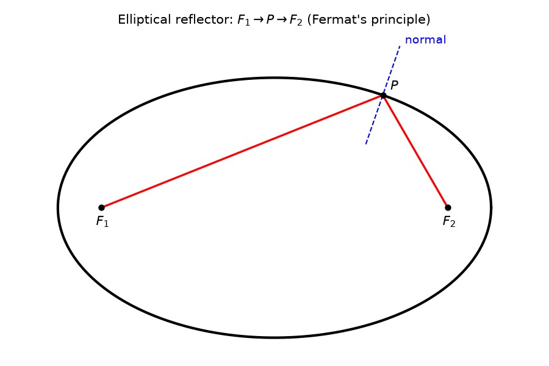
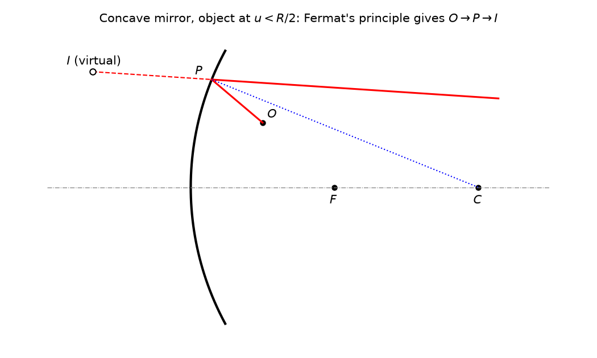

# Module I: Geometrical Optics (Fermat's Principle, Spherical Surfaces and Thin Lens)

**Syllabus scope:** Fermat's principle (laws of reflection and refraction); refraction and reflection at a single spherical surface; thin lens, principal foci and focal length; Newton formula and lateral magnification.

**Reference:** Ghatak, *Optics* (6th ed.), sections 3.1, 3.2, 4.1 to 4.7.

**Source key:** N24 = Nov 2024, N25 = Nov 2025, N19 = Nov 2019, N20 = Nov 2020, N22 = Nov 2022 (all from the source folder).

---

## Section A: Short answer (2 marks each)

**A1.** Define a thin lens. *(N24, Q1)*

**A2.** Define first principal focus of a lens. *(N24, Q2)*

**A3.** Define lateral magnification. *(N24, Q3)*

**A4.** Refractive index of glass is 1.5 and that of water is 1.33. If a biconvex lens of glass is immersed in water, will it act as a converging lens? Justify your answer. *(N25, Q1)*

**A5.** State Fermat's principle of stationary time. Explain with respect to an elliptical reflector. *(N19, Q11)*

**A6.** Write down the three results obtained from Fermat's principle. *(N20, Q11)*

**A7.** Explain Fermat's principle of extremum path. *(N22, Q11)*

---

## Section B: Paragraph / problem type (4 to 5 marks each)

**B1.** Derive the condition for image plane with respect to a refracting surface. *(N19, Q18, 4 marks)*

**B2.** Use Fermat's principle to determine the mirror equation for an object point at a distance less than $R/2$ from a concave mirror of radius of curvature $R$. *(N20, Q25, 4 marks)*

**B3.** A biconvex lens of refractive index 1.5 has radii of curvatures of 50 cm and 100 cm. Find the distance to the object if the image has to be formed at 60 cm from the lens. *(N25, Q13, 5 marks)*

Given:

$$
n = 1.5, \qquad R_1 = 50\ \text{cm}, \qquad R_2 = 100\ \text{cm}, \qquad v = 60\ \text{cm}
$$

Find $u$.

---

## Practice session: 10 marks

**Answer all four questions. Total marks: 10.**

**Q1. (2 marks)** State Fermat's principle of stationary time. Using this principle, derive the law of reflection for a ray reflected at a plane surface.

---

**Q2. (3 marks)** A point object $O$ lies on the axis of a convex spherical surface of radius $R$ which separates a medium of refractive index $n_1$ (containing $O$) from a medium of refractive index $n_2$. The object is at distance $u$ from the pole of the surface and its image is formed at distance $v$ from the pole. Using the paraxial approximation, derive the relation

$$
\frac{n_1}{u} + \frac{n_2}{v} = \frac{n_2 - n_1}{R}
$$

Draw a labelled ray diagram for the refraction.

---

**Q3. (2 marks)** Define the first principal focus and the second principal focus of a thin lens. A thin biconvex lens made of glass of refractive index $1.5$ has both surfaces of radius of curvature $20$ cm and is placed in air. Find its focal length.

---

**Q4. (3 marks)** For a thin converging lens of focal length $f$, let an object be at distance $x_1$ from the first principal focus and let its image be at distance $x_2$ from the second principal focus. Derive Newton's formula

$$
x_1 x_2 = f^2
$$

and show that the lateral magnification is

$$
m = \frac{f}{x_1} = \frac{x_2}{f}
$$

## Notes for cross-checking

Questions set on the 2019 to 2022 papers that use the system (ray transfer) matrix method were left out. The matrix method belongs to Ghatak ch. 5 and is not in the Module I syllabus. Those questions are: N19 Q23 (translation matrix), N19 Q25 (system matrix, thin lens), N20 Q12 (system matrix), N20 Q18 (system matrix, thick lens), N22 Q18 (system matrix for thin film, hence thin lens formula), and N22 Q25 (two thin lenses in combination).
